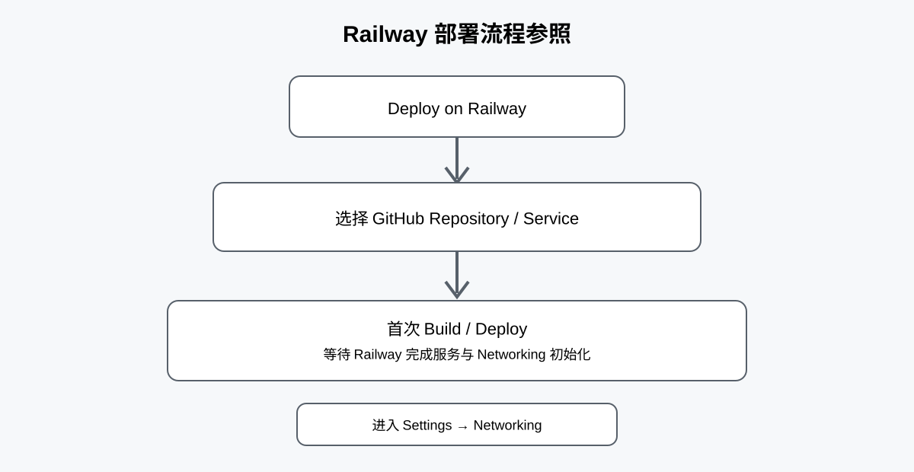
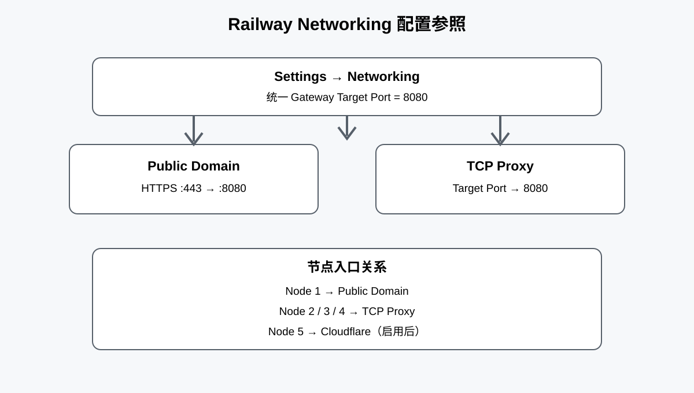
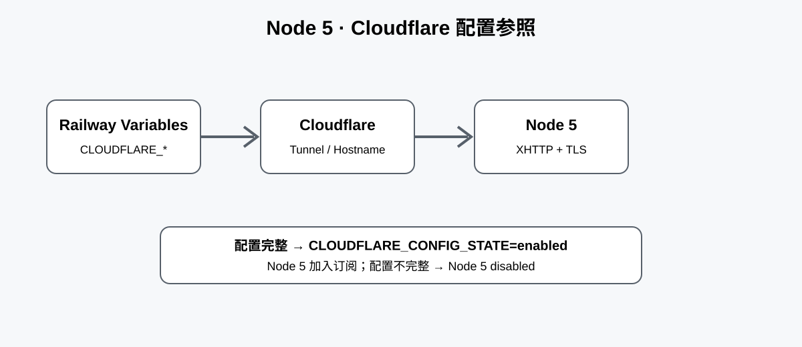
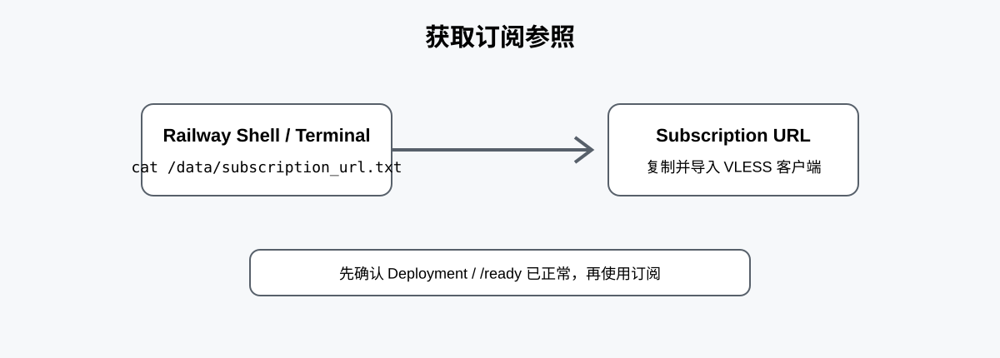

# Web UI + Railway + 动态订阅生成

目前仓库是：
Railway-native 通用部署版本
---
也就是：
任意 GitHub 账户 → 任意仓库 → 任意新的 Railway Project/Service → 按 README 配置 Railway Networking → 可部署。

> **推荐部署方式：直接使用当前 GitHub 仓库 / Railway Deploy 按钮。**

---

# 🚀 Deploy on Railway

## 1. 一键部署

点击：

<p align="center">
  <a href="https://railway.com/new/github?utm_source=github&utm_medium=readme&utm_campaign=railway-portable">
    
  </a>
</p>

选择仓库后刷新 Railway 页面，确认已经进入项目。



---

# 2. Railway 基础配置

第一次部署时，Railway 需要完成服务Networking 的初始化。

# 3. Networking

## Gateway Port

统一使用：

```text
8080
```

创建：

1. **Public Domain**
2. **TCP Proxy**

TCP Proxy 的：

```text
Target Port = 8080
```



# 4. 首次部署为什么可能需要等待？

Railway 首次创建 Public Domain / TCP Proxy 后，Networking 资源可能比容器启动稍晚完成。

本项目已经加入 **Networking Race Hardened**：

```text
启动
 ↓
读取当前 Deployment Networking
 ↓
Networking 未就绪？
 ↓
32s
 ↓
60s
 ↓
最多等待 180s
 ↓
Networking READY
 ↓
写入 current-deployment-environment snapshot
 ↓
Production Guard
 ↓
生成节点
 ↓
Endpoint Invariant
 ↓
Xray 配置检查
 ↓
启动 Xray / Gateway
```

因此：

**第一次部署出现短暂 Networking 未就绪，不代表部署失败。**

正常情况下等待程序自动完成 discovery 即可。

只有在整个等待窗口结束后仍然无法获得有效的当前 Deployment Networking，才应检查 Railway Networking 配置。

### 不建议的操作

不要因为第一次启动时短暂没有读取到 Networking 就立即：

- 删除 Public Domain
- 删除 TCP Proxy
- 重新创建服务
- 修改节点配置
- 修改订阅配置

优先等待自动 retry 完成。


# 5. Node 5 Cloudflare 配置

如果需要第 5 个节点，在 Railway Variables 中配置：

```text
CLOUDFLARE_TUNNEL_TOKEN
CLOUDFLARE_TUNNEL_ID
CLOUDFLARE_PUBLIC_HOSTNAME
CLOUDFLARE_ORIGIN_SERVICE
CLOUDFLARE_XHTTP_PORT
CLOUDFLARE_XHTTP_PATH
```



完成后点击：

```text
Deploy
```

---

# 6. 获取订阅

部署成功后，可以进入 Railway Shell / Terminal。

执行：

```bash
cat /data/subscription_url.txt

```



复制输出的订阅链接，导入支持 VLESS 的客户端。

---


# 7. 订阅节点顺序

正常 4 节点：

```text
1. railway-xhttp-tls
2. raw-reality-vision
3. xhttp-reality
4. grpc-reality
```

Cloudflare 配置完整时：

```text
5. cloudflare-xhttp-tls
```

---

# 8. 常见问题

## Q1：第一次部署 Networking 显示异常怎么办？

先等待。

本版本会自动进行 Networking discovery retry，最多等待约 180 秒。

如果最终仍然失败，再检查：

- Public Domain 是否存在
- TCP Proxy 是否存在
- TCP Proxy Target Port 是否为 `8080`
- Service 是否已经重新部署
- Railway 当前 Deployment 是否已经获得新的 Networking 环境变量

---

## Q2：重新创建 Networking 后为什么需要重新部署？

Railway Networking 发生变化后，当前 Deployment 需要重新获得新的环境状态。

推荐：

```text
修改 / 创建 Networking
        ↓
Redeploy
        ↓
读取 current-deployment-environment
        ↓
重新生成 runtime
        ↓
重新生成 subscription
```

不要继续使用旧的 `/data` endpoint 作为权威地址。

---

## Q3：为什么有时只有 4 个节点？

如果 Cloudflare 配置没有完整提供：

```text
CLOUDFLARE_TUNNEL_TOKEN
CLOUDFLARE_TUNNEL_ID
CLOUDFLARE_PUBLIC_HOSTNAME
CLOUDFLARE_ORIGIN_SERVICE
CLOUDFLARE_XHTTP_PORT
CLOUDFLARE_XHTTP_PATH
```

Node 5 会自动 disabled。

这是正常行为。

---

## Q4：为什么 Node 2–4 使用 TCP Proxy？

因为这三个节点需要 TCP/REALITY 传输入口。

它们不是普通 HTTP ingress：

```text
Node 2 = RAW REALITY
Node 3 = XHTTP REALITY
Node 4 = gRPC REALITY
```

因此不能简单把它们全部改成 Railway Public HTTPS Domain。

---

# ⚠️ 使用说明

本项目仅供学习、研究和合法的网络技术测试使用。

请遵守所在地区法律法规、Railway、Cloudflare 及相关服务的使用条款。
